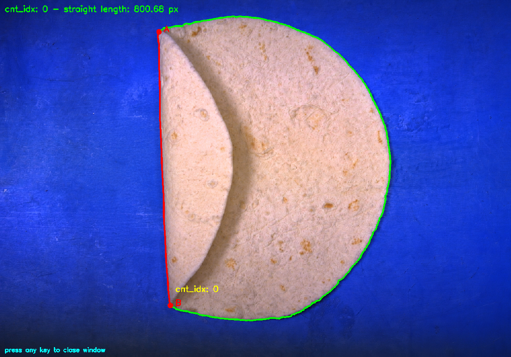

# cv_straight_line_analyzer

Проект предназначен для автоматического поиска методами компьютерного зрения прямолинейного участка на искривленном внешнем контуре продукта

Содержание:
* [запуск проекта](#запуск)
* [описание алгоритма](#описание-алгоритма)
* [оценка сложности](#оценка-сложности)
* [пример результата](#пример-результата)

## запуск

создайте venv и активируйте окружение

при использовании UV:
<pre>
uv run app/main.py
</pre>

или
<pre>
python app/main.py
</pre>

## описание алгоритма
1. Аппроксимация найденного "сырого" внешнего контура объекта алгоритмом Дугласа-Пекера (cv2.approxPolyDP) для оптимизации дальнейшего анализа контура путем уменьшения количества значимых точек.
2. Дублирование контура для учета возможного прохождения прямолинейного участка через конец и начало списка точек.
3. Итеративный перебор начала (т.A) и конца (т.B) потенциально прямолинейного участка и оценка промежуточных точек (т.C), входящих в этот диапазон. Оценка т.C осуществляется путем вычисления расстояния *h* (ортогонального) до прямой AB. *h* - это отношение векторного произведения векторов AB и AC (|AB x AC|) к длине вектора AB (евклидово расстояние между т.A и т.B). Если *h* меньше, чем максимально допустимое отклонение точек края от прямой (curvature_threshold_px), то текущая т.C удовлетворяет условию прямолинейности участка между т.A и т.B. Иначе текущий участок между т.A и т.B бракуется.

## оценка сложности
**М** - количество точек контура до аппроксимации approxPolyDP
**N** - количество точек после аппроксимации (N < M)

* сложность по времени: $O(M^2)+O(N^3)$
* сложность по памяти: $O(M)$

## пример результата

